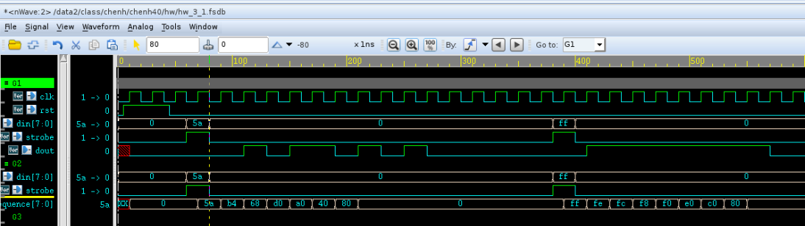
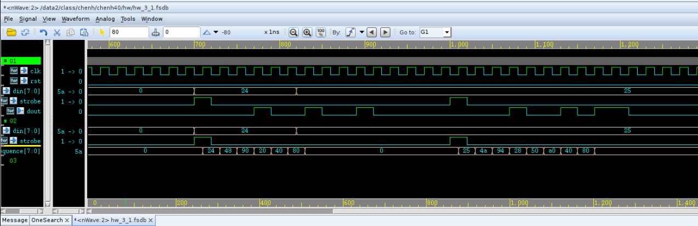
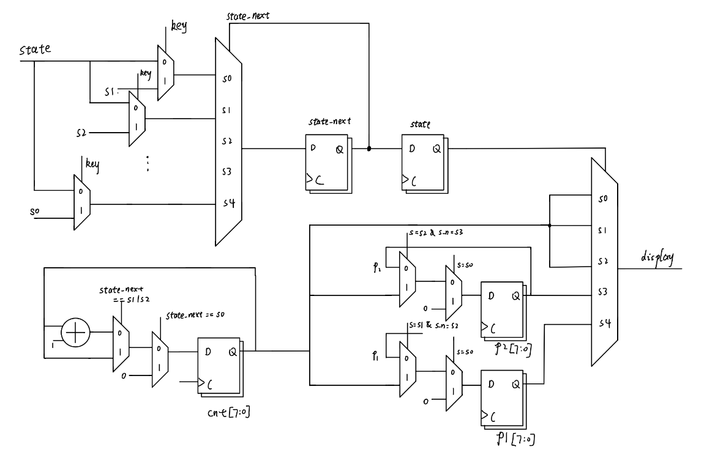
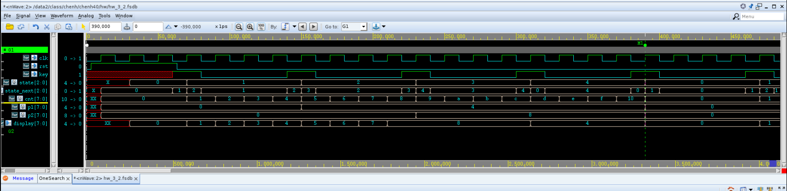
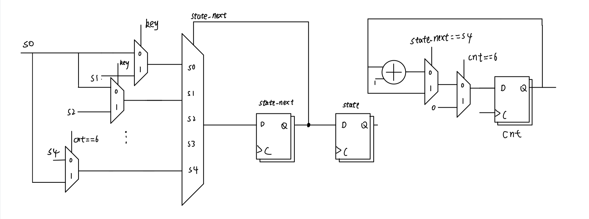
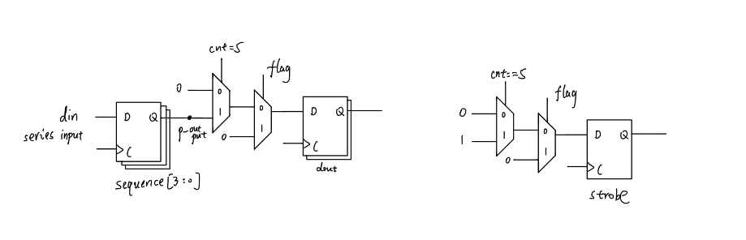
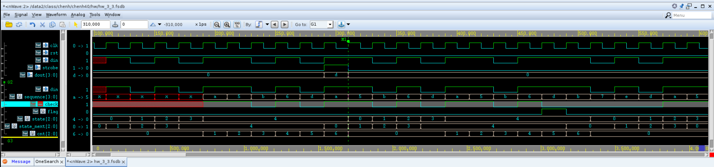

### IC_HW_3

2021211039 刘沁雨

#### HW_3_1

**原理示意图**

dout输出部分为了和示例保持一致，加了一个寄存器，延迟一个周期输出


**源代码**

```verilog
module hw_3_1 (
    input       [7:0]din,
    input       clk,rst,strobe,
    output  reg dout 
);
    reg [7:0]sequence;
    reg   odd_check;
    reg     [3:0]cnt;

    always @(posedge clk) begin
        if(rst|strobe)
            odd_check <= 0;
        else
            odd_check <= (odd_check ^ dout);
    end

    always @(posedge clk) begin
        if(rst|strobe)
            cnt <= 0;
        else
            cnt <= cnt + 1;
    end

    always @(posedge clk) begin
        if(rst)
            sequence <= 8'b0;
        else if(strobe)
            sequence <= din;
        else
            sequence <= {sequence[6:0],1'b0};
    end

    always @(posedge clk) begin	
        if(rst) dout <= 0;
        else if(cnt == 8) dout <= ~odd_check;
        else dout <= sequence[7];
    end
endmodule
```

**仿真结果**

第一张图G1验证示例功能



第二张图G2，控制strobe信号晚于输入信号输入，验证strobe的低电平信号期间，输入信号无效。可以看到25等到strobe信号置一才被输入到寄存器串中，对输入的隔绝符合预期。



#### HW_3_2

**原理示意图**



**源代码**

```verilog
module hw_3_2 (
    input clk,key,rst,
    output reg [7:0]display
);
    parameter s0 = 3'b000, //清零
              s1 = 3'b001, //计数开始
              s2 = 3'b010, //记住p1
              s3 = 3'b011, //计数停止，输出p2
              s4 = 3'b100; //输出p1

    reg [2:0]state, state_next;
    reg [7:0] cnt,p1,p2;

    always@(posedge clk) begin
        if(rst)
            state_next <= s0;
        else
            state <= state_next;
    end

    always @(*) begin
        case(state) 
            s0: begin display = cnt; if(key) state_next = s1; else state_next = s0; end
            s1: begin display = cnt; if(key) state_next = s2; else state_next = s1; end
            s2: begin display = cnt; if(key) state_next = s3; else state_next = s2; end
            s3: begin display = p2;  if(key) state_next = s4; else state_next = s3; end
            s4: begin display = p1;  if(key) state_next = s0; else state_next = s4; end
        endcase
    end

    always @(posedge clk) begin
        if(rst|state_next == s0) begin
            cnt <= 0;
            p1 <= 0;
            p2 <= 0;
        end
        else if(state_next == s1|s2) 
            cnt <= cnt + 1;
        if(state == s1 && state_next == s2) p1 <= cnt;
        if(state == s2 && state_next == s3) p2 <= cnt;
    end           
endmodule
```

**仿真结果**

设定每四个周期按压一次key，可以看到输出结果符合预期，



#### HW_3_3

**原理示意图**

这块模块间互联有点麻烦，就分小模块展示

1. 状态机模块 + 计数器模块



2. 串入并出模块以及求奇校验位的模块


3. 控制输出 dout 和 strobe 的模块（输出端的寄存器也是为了使时钟周期保持与示例一致） 



**源代码**

```verilog
module hw_3_3 (
    input clk,rst,
    input din,
    output reg [3:0]dout,
    output reg strobe
);
    reg [3:0]sequence;
    reg [2:0] state, state_next, cnt;
    wire check;
    reg flag;

    assign check = ~(1^0^1^0^sequence[3]^sequence[2]^sequence[1]^sequence[0]);
    parameter s0 = 3'b000, 
              s1 = 3'b001, 
              s2 = 3'b010, 
              s3 = 3'b011,
              s4 = 3'b100;
              

    always@(posedge clk) begin
        if(rst)
        state <= 0;
        else
        state <= state_next;
    end

    always @(*) begin
        if(rst)
        state_next = 0;
        else begin
            case (state)
            s0: if(din) state_next = s1;  else  state_next = s0;
            s1: if(!din) state_next = s2;  else  state_next = s0; 
            s2: if(din) state_next = s3;  else  state_next = s0;
            s3: if(!din) state_next = s4;  else  state_next = s0;
            s4: if(cnt == 6) state_next = s0; 
            default:         state_next = s0; 
        endcase
        end
    end

    always @(posedge clk) begin
        if(rst|cnt==6)   cnt <= 0;
        else if(state_next == s4)
        cnt <= cnt + 1;
    end

    always @(*) begin
        if(cnt == 5) flag = check^din;
        else flag = 0;
    end

    always @(posedge clk) begin
        if(rst)
        sequence <= 0;
        else
        sequence <= {sequence[2:0],din};
    end

    always @(posedge clk) begin
        if(rst|flag) begin
        dout <= 0;
        strobe <= 0;
        end
        else if(cnt == 5) begin
        dout <= sequence;
        strobe <= 1;
        end
        else begin
        dout <= 0;
        strobe <= 0;
        end
    end
endmodule
```

**仿真结果**

G1框图中M1前部分展示的是示例部分的输出。

G2展示的是在M1后，各个模块的子状态被成功复位到初始状态，并能够正常继续工作（检测到新的1010序列），不受干扰。

输入序列数据保持不变，奇偶校验位改变（1010_1011_1），最终输出始终保持为0，可见数据校验功能正常。

